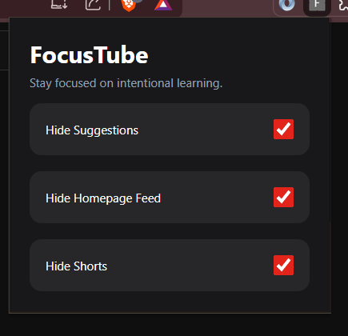
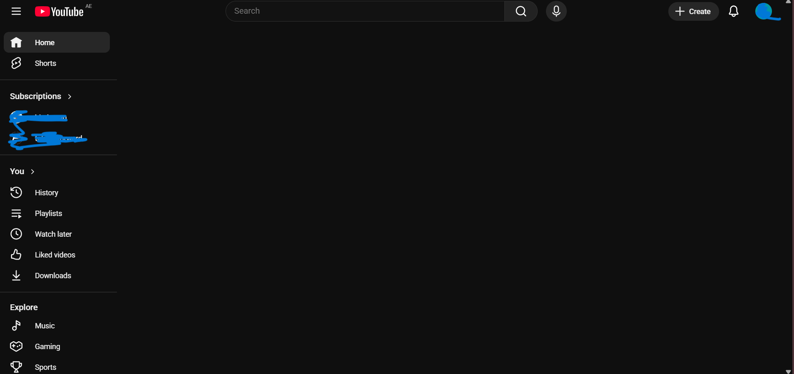
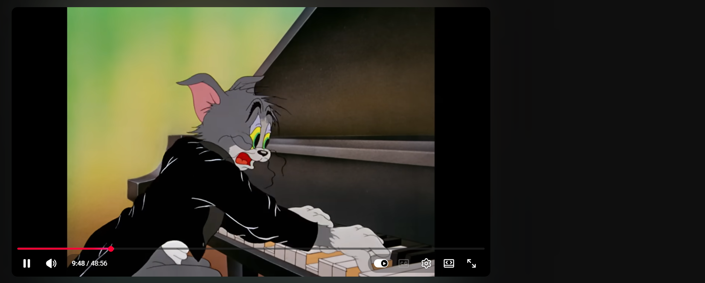

# FocusTube Chrome Extension

A distraction-free YouTube experience built for students, developers, and deep work sessions.

FocusTube removes distracting YouTube elements like:
- suggested videos
- homepage feed
- Shorts

so users can focus only on the content they intentionally opened.

---

# Problem Statement

Many people open YouTube with a specific purpose:
- watching a tutorial
- studying from an article
- learning programming
- researching a topic

But YouTube's recommendation system often causes distraction through:
- suggested videos
- endless homepage feeds
- Shorts content

This extension was built to reduce distraction and help users stay focused on intentional learning.

---

# Features

## Current Features

- Hide suggested videos sidebar
- Hide YouTube homepage feed
- Hide Shorts sections
- Persistent user settings using Chrome Storage API
- Real-time UI updates
- Dynamic YouTube DOM handling using MutationObserver

---

# Screenshots

## Popup UI



---

## Homepage Feed Hidden



---

## Suggested Videos Hidden



---

# Tech Stack

## Frontend
- React
- JavaScript
- TailwindCSS
- Vite

## Browser Extension APIs
- Chrome Extension Manifest V3
- Chrome Storage API
- Content Scripts
- MutationObserver

---

# Project Architecture

```txt
Popup UI (React)
        ↓
Chrome Storage API
        ↓
Content Script
        ↓
YouTube DOM Manipulation
```

---

# How It Works

The extension injects a content script into YouTube pages.

The content script:
1. detects YouTube elements
2. hides distracting sections
3. watches for dynamic page changes using MutationObserver
4. applies user preferences in real-time

---

# Folder Structure

```txt
src/
│
├── background/
├── content/
├── popup/
├── utils/
```

---

# Installation

## Clone Repository

```bash
git clone https://github.com/shahjalalhazari/FocusTube-Chrome-Extension.git
```

---

## Install Dependencies

```bash
npm install
```

---

## Run Development Server

```bash
npm run dev
```

---

## Build Extension

```bash
npm run build
```

---

# Load Extension Into Chrome

1. Open:
```txt
chrome://extensions
```

2. Enable:
```txt
Developer Mode
```

3. Click:
```txt
Load Unpacked
```

4. Select:
```txt
dist/
```

---

# Future Roadmap

## Planned Features

- Hide comments section
- Focus mode
- Pomodoro timer integration
- End-screen recommendation blocking
- Study session analytics
- Website blocking mode
- AI-powered focus assistant
- Cross-device sync
- User accounts and cloud settings

---

# Challenges Faced

## Dynamic YouTube Rendering

YouTube dynamically re-renders content using React, which causes hidden elements to reappear.

This was solved using:
- MutationObserver
- DOM re-processing
- persistent element detection

---

# Learning Outcomes

This project helped me learn:
- Chrome Extension development
- Manifest V3
- Content scripts
- Chrome Storage API
- DOM manipulation
- MutationObserver
- React integration in extensions
- Dynamic webpage handling

---

# Author

Built by Shahjalal Hazari

GitHub:
https://github.com/shahjalalhazari

LinkedIn:
https://www.linkedin.com/in/shahjalalhazari/

---

# License

MIT License

Copyright (c) 2026 Shahjalal Hazari

Permission is hereby granted, free of charge, to any person obtaining a copy
of this software and associated documentation files...
